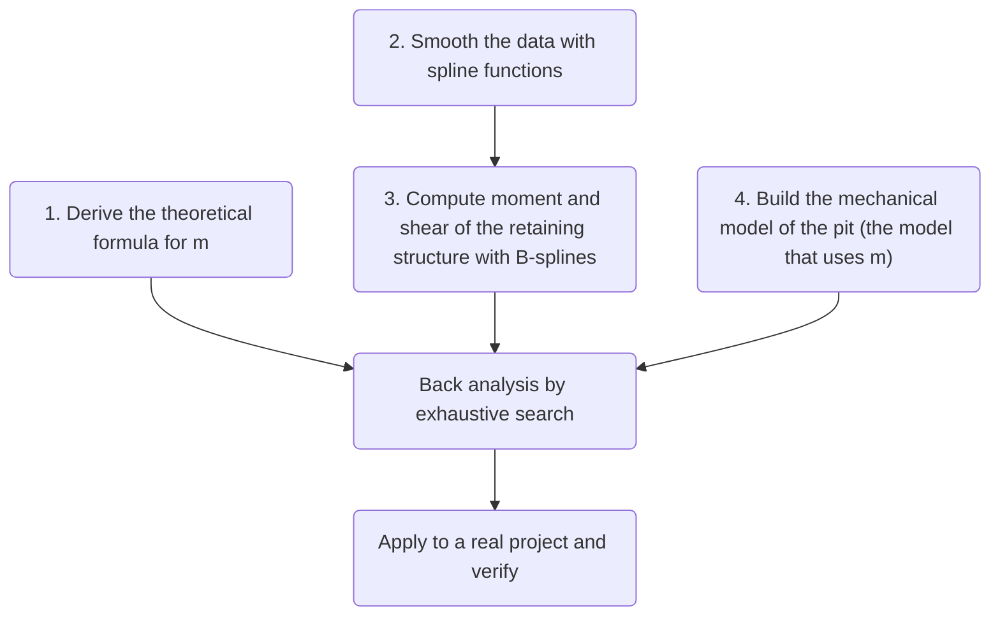

# Paper Reading 1 - Back Analysis of the m Value of Soil Layers in Foundation Pits

## Preface

This is my first attempt to change how I read papers, moving from <u>reading locally + mind maps</u> to <u>Markdown notes + deconstructing the paper</u>. The paper I read this time is: [Back Analysis of the m Value of Soil Layers in Foundation Pits - Hu Rui](https://kns.cnki.net/kcms2/article/abstract?v=9CXCstbk-tt-_FO9teqNf856s6iRcafs1_ub9TH8RP7e6LuOJ0wUXOOZ7spaK-pvEA5Q25jo6dQ36KpjwX7uhQvls06lP28LedjI8xfFVIdvnYwZPKArDTbiMQFNmHGuDVvMkiqg4xNb5-Imp7JJsA==&uniplatform=NZKPT&language=CHS) [[access from China](https://kns.cnki.net/kcms2/article/abstract?v=9CXCstbk-tt-_FO9teqNf856s6iRcafs1_ub9TH8RP7e6LuOJ0wUXOOZ7spaK-pvEA5Q25jo6dQ36KpjwX7uhQvls06lP28LedjI8xfFVIdvnYwZPKArDTbiMQFNmHGuDVvMkiqg4xNb5-Imp7JJsA==&uniplatform=NZKPT&language=CHS)] [[access from abroad](https://scholar.google.com/scholar?hl=zh-CN&as_sdt=0%2C5&q=%E5%9F%BA%E5%9D%91%E5%9C%9F%E5%B1%82m%E5%80%BC%E5%8F%8D%E6%BC%94%E5%88%86%E6%9E%90%E7%A0%94%E7%A9%B6&btnG=)], Master's thesis, Kunming University of Science and Technology (in Chinese).

## Background, Concepts and Methodology

### 1. Background and Concepts

Many geotechnical projects involve underground soil and rock. Because soil and rock are complex, <u>forward analysis</u> often fails to give accurate results, and because geotechnical parameters are uncertain, engineers often need to <u>back-analyse</u> the parameters from measured data before further study.

Table 1. Glossary Ⅰ

| Term           | Meaning                                                         |
| -------------- | ------------------------------------------------------------ |
| Forward analysis | Given the model parameters, compute the model response, such as displacement and internal forces. In geotechnical engineering: given the soil parameters, compute the deformation and internal forces of the retaining structure by mechanics. |
| Back analysis (inverse analysis) | Given the model response, infer the model parameters. In geotechnical engineering: use monitored data such as retaining structure displacement to infer soil mechanical parameters such as the elastic modulus and cohesion. |

The design methods for foundation pit retaining structures that appear most often in journal papers and theses are:

1. Elastic foundation beam method (also called the elastic support method): the method most widely used in China and preferred in practice. The retaining structure (piles, etc.) is simplified as a beam and the soil as an elastic foundation modelled with springs, solved under the Winkler assumption (the soil reaction at any point of the beam is proportional to the displacement at that point). This is the method the thesis focuses on.
2. Limit equilibrium method: assumes the soil is in limit equilibrium and computes the internal forces and stability of the retaining structure from the limit equilibrium equations.
3. Finite element method: discretizes the soil and retaining structure into finite elements, defines constitutive relations, considers soil–structure interaction, and solves for displacements and internal forces numerically. Widely used commercial software such as PLAXIS, FLAC and ABAQUS makes finite element analysis convenient.
4. Trench wall stability method: determines internal forces and sections of the retaining structure by analysing the stability of an unsupported trench wall. Simple, but cannot account for deformation.
5. Empirical and analogy methods: choose the type and size of the retaining structure from experience with similar projects. Useful for preliminary design but lacks a theoretical basis.
6. Reliability analysis: based on probability theory, accounts for uncertainty in loads, materials and computational models in reliability analysis and design.
7. Intelligent optimization design: uses genetic algorithms, particle swarm optimization and similar methods to optimize the size and materials of the retaining structure, minimizing quantities or cost.

Current geotechnical investigation reports cannot yet reliably provide the horizontal subgrade coefficient of each soil layer. Meanwhile, much engineering practice and analysis shows that m, the proportionality coefficient of the horizontal reaction coefficient of the soil, strongly affects the deformation and internal forces of the retaining structure, and can even determine which retaining scheme is chosen.

Table 2. Glossary Ⅱ

| Term                   | Symbol | Meaning                                                         |
| ---------------------- | ------------- | ------------------------------------------------------------ |
| Horizontal subgrade coefficient         | kh | The ratio of the horizontal reaction provided by the soil to the horizontal displacement of the retaining structure, k = p/y, where p is the horizontal reaction and y is the displacement. It characterizes the horizontal deformability of the soil, similar to a spring stiffness, and usually increases with depth. (Hooke's law from high school, again.) |
| Proportionality coefficient of the horizontal reaction coefficient | m             | The gradient of the horizontal subgrade coefficient with depth. The m method assumes kh is linear in depth z: kh = m × z. The m value shows how quickly the horizontal stiffness of the soil increases with depth; the larger m, the faster it increases. |

Both coefficients describe the horizontal support the soil gives the retaining structure and are key parameters for evaluating soil deformation. The m value is used directly as a design parameter in the elastic foundation beam method. But because there are no laboratory or in-situ tests for them, investigation reports rarely give these coefficients directly. So in pit support design, m is usually chosen by the designer from experience or determined by back analysis.

A simple calculation example shows how m affects the deformation and internal forces of the retaining structure.

Assume a simply supported beam-type retaining structure of length L under a uniform load q. The flexural rigidity of the beam is EI and the horizontal subgrade coefficient is kh = mz. By elastic foundation beam theory, the differential equation of the beam is:
$$
EI\frac{d^4y}{dz^4}+mz y=q
$$
where y is the horizontal displacement of the beam.

Take m = 0, m = 1000 and m = 5000, representing soil stiffness from low to high, with the other parameters:
$$
L=10\mathrm{m}, q=100\mathrm{kN}/\mathrm{m}, EI=1\times10^6 \mathrm{kN}\cdot \mathrm{m}^2
$$

Solving the equation numerically by finite differences gives the displacement and bending moment along the depth:

Table 3. Finite difference results for the example

| Depth z (m) | Displacement y (mm) |        |        | Bending moment M (kN · m) |        |
| ---------- | ----------- | ------ | ------ | --------------- | ------ |
|            | m=0         | m=1000 | m=5000 | m=0             | m=1000 |
| 0          | 51.7        | 28.4   | 13.1   | 0               | 0      |
| 2.5        | 48.9        | 18.6   | 5.1    | 122             | 58.6   |
| 5          | 43.4        | 9.6    | 1.6    | 217             | 78.5   |
| 7.5        | 35.3        | 3.4    | 0.3    | 265             | 63.4   |
| 10         | 25          | 0.3    | 0      | 250             | 25     |

The results show:
The larger m, the smaller the displacement of the retaining structure. At m = 0 (no soil support), the maximum displacement is 51.7 mm; at m = 5000 it falls to 13.1 mm, a 75% reduction.
The larger m, the smaller the bending moment. At m = 0 the maximum moment is 265 kN·m; at m = 5000 it falls to 25 kN·m, a 91% reduction.
As m increases, the moment distribution changes from trapezoidal to triangular and the point of maximum moment moves up, showing that the shape and magnitude of passive earth pressure depend strongly on m.

Figure 1. Bending moment versus the parameter m in the example

Having seen how m affects horizontal reaction, structure/soil displacement and bending moment, let's return to the thesis and look at how m can be back-analysed. The thesis mentions several common back-analysis methods:

1. Direct methods (direct approximation): treat parameter identification as optimizing an objective function and directly correct the parameter estimates by iteratively minimizing an error function, e.g. the univariate method, pattern search, Powell's method and the simplex method.
2. Gradient methods: such as steepest descent, conjugate gradient and Newton's method, which use gradient information of the objective function to speed up optimization but require derivatives.
3. Artificial intelligence algorithms: such as neural networks, swarm intelligence, simulated annealing, evolution strategies and genetic algorithms, which use random search and heuristic rules to find a global optimum and suit complex non-linear multi-parameter problems. However, they ignore the physical constitutive relations of the soil and describe the non-linear relation between soil parameters and displacement directly, so they lack a physical explanation.

(Extension) Besides the methods in the thesis, other common back-analysis methods include:

4. Bayesian methods: based on Bayesian statistics, treat the parameters as random variables and update their posterior distribution with Bayes' formula, quantifying the uncertainty of the result. Common algorithms include Markov chain Monte Carlo (MCMC) and Kalman filtering.
5. Monte Carlo method: generate many possible parameter combinations by random sampling, compute the responses with the forward model, and select the best parameters by how well the responses match the measurements. Simple in principle but computationally expensive.
6. Response surface method: choose a limited number of parameter combinations by orthogonal experimental design, compute their responses with the forward model, fit the parameter–response relation with a polynomial (the response surface), and search it with an optimizer. This reduces the number of forward calculations.
7. Ensemble Kalman filter (EnKF): combines the Kalman filter with Monte Carlo, representing the probability distribution of state variables and parameters by a set of random samples (the ensemble), and estimates their optimal values and uncertainty from the ensemble mean and variance.
8. Hybrid algorithms: combine different back-analysis algorithms to use their strengths, e.g. genetic algorithms with neural networks, or particle swarm with simulated annealing.

The thesis mainly uses a back-analysis method based on exhaustive search, described in the methodology section below.

### 2. Methodology / Technical Route

The thesis proposes a back-analysis algorithm that combines <u>spline functions</u>, the <u>elastic support method for planar frame structures</u> and <u>exhaustive search</u>. (It sounds impressive, but it becomes simple once we take it apart; reading papers is all about deconstructing them and their methods.)

Table 4. Glossary Ⅲ

| Term                     | Meaning                                                         |
| ------------------------ | ------------------------------------------------------------ |
| Spline function                 | A piecewise polynomial function, widely used in numerical analysis for function approximation and data fitting. Each segment is a low-order polynomial and certain continuity conditions hold at the knots, so it is smooth and approximates well. |
| Elastic support method for planar frame structures | A common method for calculating retaining structures, also called the elastic foundation beam method. The retaining structure is simplified to a planar frame model and the soil to a series of independent elastic supports (springs); structural mechanics is then used to solve for deformation and internal forces. |
| Exhaustive search               | The simplest and most direct parameter identification method, also called grid search or enumeration. Within the possible range of the parameters, enumerate all combinations, compute the model response for each with the forward model, rate the goodness of fit by some criterion (such as least squares error), and pick the best parameters. |

Let's see how each of these three concepts is used in the thesis:

1. Spline curves (really just data smoothing): the author uses cubic splines to smooth the measured displacement data of the retaining structure, to reduce the effect of measurement errors and give a more reliable basis for back analysis. Spline fitting gives a continuous displacement curve that is easy to differentiate numerically to compute rotations and internal forces.
2. Elastic support method for planar frames (to back-calculate m you need a forward model to plug into, and this is it): the author builds the forward mechanical model of the retaining structure with the elastic support method. The retaining pile is divided into beam elements; the soil above the pile toe is treated as elastic supports and the soil below as an elastic foundation beam, with horizontal loads and strut reactions considered. Setting up equilibrium and compatibility equations and solving them numerically (finite element or matrix displacement method) gives the deformation and internal forces for given parameters.
3. Exhaustive search (the actual back-analysis step; a simplified Monte Carlo): the author treats Δ1 and Δ2 in the m formula as the unknown parameters and generates many possible combinations within a range. For each combination, the elastic support method computes deformation and internal forces, which are compared with measurements; the combination with the smallest error is chosen, giving the equivalent m value of the soil layer.

Put simply: splines for preprocessing, the elastic support method for forward calculation, exhaustive search for parameter selection.

Figure 2. Technical route in the thesis

In my view, the back-analysis algorithm has some theoretical basis and practical effect, but also limitations, such as heavy computation and no guaranteed convergence. You can judge the novelty and practicality of the thesis using my earlier post "[Methods and Tips for Finding Innovation Points in Academic Journal Papers](/2024/04/10/en/finding-innovation-points-in-journal-papers/)".

## Detailed Back Analysis and Calculation Process

We reproduce the derivation in the following steps:

### 2.1 Deriving the Theoretical Formula for m

1. Assume the toe of the retaining structure is embedded deep enough in the soil below the pit bottom. When the pit is in the elastic resistance state, the toe displacement is taken as approximately zero; when the pit reaches the passive limit state, the toe moves slightly.
2. Assume the soil in the embedded section is a single layer and the horizontal displacement of the retaining structure near the excavation level is s0.
3. Based on elastic half-space stress theory, analyse the stress on a small element in the passive zone of the embedded section and, with the linear elastic constitutive equation, derive the soil reaction:
$$
σ_x = γzk_0 + Es/(1-μ^2) * εx
$$
where σx is the horizontal stress of the passive-zone soil, γ is the unit weight, k0 is the at-rest earth pressure coefficient, Es is the elastic modulus of the passive-zone soil, μ is Poisson's ratio and εx is the horizontal strain of the passive-zone soil.

4. Because the elastic modulus and Poisson's ratio are hard to determine accurately in practice, assume that when the passive-zone soil is in the elastic resistance state the horizontal reaction coefficient can be written as:
$$
ks = mz+k_0 = mz + 2ctan(45°+φ/2) *Δ_1 /s0
$$
where m is the proportionality coefficient of the horizontal reaction coefficient, Δ1 is a strength reduction factor, c is cohesion and φ is the internal friction angle.

5. To account for unloading during excavation, introduce the excavation depth h and assume the displacement when the bottom reaches the passive limit state is:
$$
sp(z=D)=Δ_2*h
$$
Δ2 is an empirical coefficient less than 1. The final formula for m is:
$$
m=γ[tan^2(45°+φ/2)-k_0]*Δ_1/(Δ_2*h)
$$

The formula accounts for the unit weight, internal friction angle, lateral pressure coefficient and excavation depth; Δ1 and Δ2 are the parameters to be back-analysed. Specifically:

Why Δ1: unloading of the overlying soil during excavation leaves the soil near the excavation level over-consolidated, so the initial soil reaction coefficient at the excavation level A0 ≠ 0:
$$
A_0=2ctan(45°+φ/2)Δ_1/S_0
$$

Why Δ2: the m value of the soil is not fixed during excavation but decreases as the excavation deepens. The author simply assumes m varies linearly with the excavation depth h:
$$
δ_p(z=D)=Δ_2h
$$

### 2.2–2.3 Data Smoothing and Interpolation with Spline Functions

#### Why Splines

When the type of fitting function is unknown, fitting piecewise polynomials directly gives poor smoothness at the joints, so spline functions are introduced. Here is how the thesis uses splines to smooth monitoring data:

Figure 3. Flowchart of data smoothing with spline functions

1. First, given data points (xi, yi), i = 1, 2, ..., N and a weight p, find the function σ(x) that minimizes the functional J[σ]:
$$
J[f] = I_q[f] + pE_p[f] = p·∫[f^q(x)]^2 dx + ∑(f(x_i) - y_i)^2
$$
Then introduce the standard deviation σ.

2. Compute the spline basis by recursion, evaluate the B-splines at each data point and build matrix B:
$$
b_{ij} = B_j(x_i)~~~~, ~~~i,j=1,2,...N
$$
The B-splines Bj(x) are basis functions with good mathematical properties such as local support and positivity. The recursion quickly gives Bj(x) at any point x. The values Bj(xi) arranged by i, j form matrix B for later steps.

3. Compute the coefficients eij to form matrix E. eij is the q-th derivative of the B-spline at node xi times a coefficient, reflecting the smoothness of the fit at that point. Arranged by i, j they form matrix E.

4. Build the matrix:
$$
A = B + p^(-1)*E。
$$
This combines the B-spline values and derivatives into A, with the weight p balancing smoothness and closeness of fit. B reflects how closely the fit follows the data and E reflects its smoothness; p sets their relative importance: the larger p, the smoother the fit; the smaller p, the closer it follows the data.

5. Solve Ac = y for the coefficients cj. This is essentially a least squares problem: the coefficients make σ(x) as close as possible to yi at the data points while keeping it smooth.

6. Check whether the sum of (yi − σ(xi))2 is less than Nσ2. If so, go on; otherwise compute a new weight p with equation (3.30) and return to step 4. Nσ2 reflects the size of the data error. If the sum of squared differences is below it, the fit is close enough and the result can be output; otherwise p is adjusted to make the fit smoother or closer until the condition holds.

7. Obtain the smoothing spline:
$$
 σ(x) = ∑c_j*B_j(x)。
$$
Substituting the coefficients cj into the linear combination of B-splines gives the final smoothing spline σ(x), which approximates yi at the data points and interpolates smoothly elsewhere thanks to the properties of B-splines.

Overall, the method uses B-splines to build a fitting function with adjustable smoothness and closeness, solves for the coefficients by least squares, and iteratively tunes the weight to find the best smoothing.

### 2.4 Building the Mechanical Model of the Pit

The mechanical model in the thesis follows the Chinese *Technical Specification for Retaining and Protection of Building Foundation Excavations* (JGJ 120-2012) and is not repeated here.

### 2.5 Back Analysis with Monte Carlo and Exhaustive Search

The thesis only introduces the concepts and methods (no MATLAB code is given even for the field validation), so here is an external link on the [Monte Carlo method](https://en.wikipedia.org/wiki/Monte_Carlo_method).

The theory part of the thesis ends with a flowchart:

Figure 4. Flowchart of the back analysis

The last two theory parts are fairly simple, and the experimental validation is only briefly covered in the thesis, so I won't go into more detail.

## <u>References</u>

1.  Hu Rui. (2017). *Back Analysis of the m Value of Soil Layers in Foundation Pits* (Master's thesis, Kunming University of Science and Technology). (In Chinese.)
