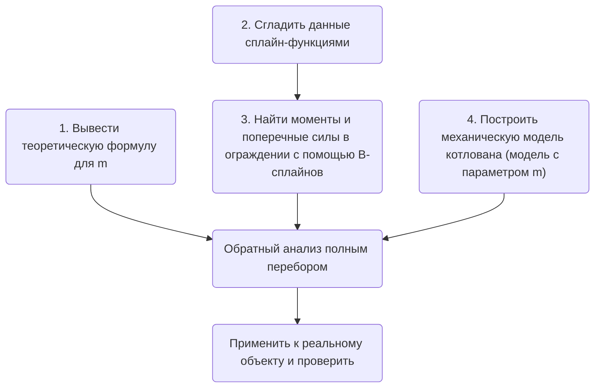

# Обзор статьи 1 - Обратный анализ коэффициента m грунтов котлована

## Предисловие

Это моя первая попытка изменить способ чтения научных работ: перейти от <u>чтения на компьютере + интеллект-карт</u> к <u>заметкам в Markdown + разбору работы по частям</u>. На этот раз я читал: [Обратный анализ коэффициента m грунтов котлована — Ху Жуй](https://kns.cnki.net/kcms2/article/abstract?v=9CXCstbk-tt-_FO9teqNf856s6iRcafs1_ub9TH8RP7e6LuOJ0wUXOOZ7spaK-pvEA5Q25jo6dQ36KpjwX7uhQvls06lP28LedjI8xfFVIdvnYwZPKArDTbiMQFNmHGuDVvMkiqg4xNb5-Imp7JJsA==&uniplatform=NZKPT&language=CHS) [[доступ из Китая](https://kns.cnki.net/kcms2/article/abstract?v=9CXCstbk-tt-_FO9teqNf856s6iRcafs1_ub9TH8RP7e6LuOJ0wUXOOZ7spaK-pvEA5Q25jo6dQ36KpjwX7uhQvls06lP28LedjI8xfFVIdvnYwZPKArDTbiMQFNmHGuDVvMkiqg4xNb5-Imp7JJsA==&uniplatform=NZKPT&language=CHS)] [[доступ из-за рубежа](https://scholar.google.com/scholar?hl=zh-CN&as_sdt=0%2C5&q=%E5%9F%BA%E5%9D%91%E5%9C%9F%E5%B1%82m%E5%80%BC%E5%8F%8D%E6%BC%94%E5%88%86%E6%9E%90%E7%A0%94%E7%A9%B6&btnG=)], магистерская диссертация, Куньминский университет науки и технологий (на китайском языке).

## Предпосылки, понятия и методология

### 1. Предпосылки и понятия

Многие геотехнические проекты связаны с подземными грунтами и породами. Из-за их сложности <u>прямой анализ</u> часто не даёт точных результатов, а из-за неопределённости геотехнических параметров инженерам нередко приходится выполнять <u>обратный анализ</u> параметров по данным измерений, прежде чем продолжать исследование.

Таблица 1. Глоссарий Ⅰ

| Термин           | Значение                                                         |
| -------------- | ------------------------------------------------------------ |
| Прямой анализ | По известным параметрам модели вычисляется её отклик: перемещения, внутренние усилия и т. п. В геотехнике — по известным параметрам грунта методами механики вычисляются деформации и усилия в ограждающей конструкции котлована. |
| Обратный анализ | По известному отклику модели определяются её параметры. В геотехнике — по измеренным перемещениям ограждения и другим данным определяются механические параметры грунта, например модуль упругости и сцепление. |

В журнальных статьях и диссертациях чаще всего встречаются следующие методы расчёта ограждающих конструкций котлованов:

1. Метод балки на упругом основании (метод упругих опор): наиболее распространён в Китае и в первую очередь применяется на практике. Ограждение (сваи и т. п.) представляется балкой, а грунт — упругим основанием из пружин; расчёт ведётся по гипотезе Винклера (реакция грунта в любой точке балки пропорциональна перемещению в этой точке). Именно этот метод подробно рассматривается в работе.
2. Метод предельного равновесия: предполагается, что грунт находится в состоянии предельного равновесия, и по уравнениям предельного равновесия вычисляются усилия и устойчивость ограждения.
3. Метод конечных элементов: грунт и ограждение разбиваются на конечные элементы, задаются определяющие соотношения, учитывается взаимодействие грунта и конструкции, а перемещения и усилия находятся численно. Распространённые программы PLAXIS, FLAC, ABAQUS и др. позволяют удобно выполнять такой расчёт.
4. Метод устойчивости стенки траншеи: усилия и сечения ограждения определяются по устойчивости незакреплённой стенки траншеи. Метод прост, но не учитывает деформации.
5. Эмпирические методы и метод аналогии: тип и размеры ограждения выбираются по опыту аналогичных объектов. Подходит для предварительного проектирования, но не имеет теоретической основы.
6. Анализ надёжности: на основе теории вероятностей учитывается неопределённость нагрузок, материалов и расчётных моделей при расчёте и проектировании на надёжность.
7. Интеллектуальная оптимизация: генетические алгоритмы, метод роя частиц и т. п. оптимизируют размеры и материалы ограждения по критерию минимального объёма работ или стоимости.

Современные отчёты об инженерных изысканиях пока не могут достоверно дать горизонтальный коэффициент постели для каждого слоя грунта. При этом практика и расчёты показывают, что коэффициент пропорциональности m горизонтального коэффициента реакции грунта сильно влияет на деформации и усилия ограждения и даже может определять выбор схемы крепления котлована.

Таблица 2. Глоссарий Ⅱ

| Термин                   | Обозначение | Значение                                                         |
| ---------------------- | ------------- | ------------------------------------------------------------ |
| Горизонтальный коэффициент постели         | kh | Отношение горизонтальной реакции грунта к горизонтальному перемещению ограждения: k = p/y, где p — горизонтальная реакция, y — перемещение. Характеризует горизонтальную деформируемость грунта, подобно жёсткости пружины; обычно растёт с глубиной. (Снова закон Гука из школы.) |
| Коэффициент пропорциональности горизонтального коэффициента реакции | m             | Градиент изменения горизонтального коэффициента постели по глубине. В методе m принимается линейная зависимость kh от глубины z: kh = m × z. Значение m показывает, как быстро горизонтальная жёсткость грунта растёт с глубиной: чем больше m, тем быстрее. |

Оба коэффициента описывают горизонтальную поддержку, которую грунт оказывает ограждению, и являются ключевыми параметрами деформационных свойств грунта. Значение m напрямую используется как расчётный параметр в методе балки на упругом основании. Но из-за отсутствия лабораторных и полевых методов их определения отчёты об изысканиях редко дают эти коэффициенты. Поэтому при проектировании крепления котлованов m обычно выбирают по опыту или определяют обратным анализом.

Простой расчётный пример показывает, как m влияет на деформации и усилия в ограждении.

Пусть ограждение представлено свободно опёртой балкой длиной L под равномерной нагрузкой q. Изгибная жёсткость балки EI, горизонтальный коэффициент постели kh = mz. По теории балки на упругом основании дифференциальное уравнение балки:
$$
EI\frac{d^4y}{dz^4}+mz y=q
$$
где y — горизонтальное перемещение балки.

Возьмём m = 0, m = 1000 и m = 5000 — три случая жёсткости грунта от малой к большой; остальные параметры:
$$
L=10\mathrm{m}, q=100\mathrm{kN}/\mathrm{m}, EI=1\times10^6 \mathrm{kN}\cdot \mathrm{m}^2
$$

Численное решение уравнения методом конечных разностей даёт распределение перемещений и изгибающих моментов по глубине:

Таблица 3. Результаты расчёта примера методом конечных разностей

| Глубина z (м) | Перемещение y (мм) |        |        | Изгибающий момент M (кН · м) |        |
| ---------- | ----------- | ------ | ------ | --------------- | ------ |
|            | m=0         | m=1000 | m=5000 | m=0             | m=1000 |
| 0          | 51.7        | 28.4   | 13.1   | 0               | 0      |
| 2.5        | 48.9        | 18.6   | 5.1    | 122             | 58.6   |
| 5          | 43.4        | 9.6    | 1.6    | 217             | 78.5   |
| 7.5        | 35.3        | 3.4    | 0.3    | 265             | 63.4   |
| 10         | 25          | 0.3    | 0      | 250             | 25     |

Из результатов видно:
Чем больше m, тем меньше перемещение ограждения. При m = 0 (без поддержки грунта) максимальное перемещение 51,7 мм; при m = 5000 оно снижается до 13,1 мм, то есть на 75 %.
Чем больше m, тем меньше изгибающий момент. При m = 0 максимальный момент 265 кН·м; при m = 5000 — 25 кН·м, то есть меньше на 91 %.
С ростом m эпюра моментов из трапециевидной становится треугольной, а точка максимума смещается вверх: форма и величина пассивного давления грунта сильно зависят от m.

Рис. 1. Изменение изгибающего момента в зависимости от m в примере

Разобравшись, как m влияет на горизонтальную реакцию, перемещения ограждения и грунта и изгибающие моменты, вернёмся к работе и посмотрим, какими методами можно выполнить обратный анализ m. В работе упоминаются распространённые методы:

1. Прямые методы (прямого приближения): идентификация параметров рассматривается как оптимизация целевой функции; оценки параметров исправляются напрямую путём итерационной минимизации функции ошибки, например метод покоординатного спуска, поиск по образцу, метод Пауэлла, симплекс-метод.
2. Градиентные методы: наискорейший спуск, сопряжённые градиенты, метод Ньютона и др.; используют градиент целевой функции для ускорения оптимизации, но требуют вычисления производных.
3. Методы искусственного интеллекта: нейронные сети, роевой интеллект, имитация отжига, эволюционные стратегии, генетические алгоритмы; ищут глобальный оптимум случайным поиском и эвристиками и подходят для сложных нелинейных многопараметрических задач. Однако они не учитывают физические определяющие соотношения грунта и описывают нелинейную связь параметров грунта и перемещений напрямую, без физического объяснения.

(Дополнение) Кроме упомянутых в работе, распространены и другие методы обратного анализа:

4. Байесовские методы: на основе байесовской статистики параметры рассматриваются как случайные величины, а их апостериорное распределение обновляется по формуле Байеса, что позволяет количественно оценить неопределённость результата. Типичные алгоритмы — марковские цепи Монте-Карло (MCMC), фильтр Калмана.
5. Метод Монте-Карло: случайной выборкой генерируется множество комбинаций параметров, для каждой прямой моделью вычисляется отклик, а лучшие параметры выбираются по совпадению с измерениями. Принцип прост, но объём вычислений велик.
6. Метод поверхности отклика: ортогональным планированием эксперимента выбирается ограниченное число комбинаций параметров, для них вычисляются отклики, связь параметров и отклика аппроксимируется полиномом (поверхностью отклика), а затем по ней ищется оптимум. Это сокращает число прямых расчётов.
7. Ансамблевый фильтр Калмана (EnKF): сочетает фильтр Калмана с методом Монте-Карло; распределение переменных состояния и параметров представляется набором случайных выборок (ансамблем), а оптимальные значения и их неопределённость оцениваются по среднему и дисперсии ансамбля.
8. Гибридные алгоритмы: сочетают разные алгоритмы обратного анализа, используя их сильные стороны, например генетический алгоритм с нейросетью или рой частиц с имитацией отжига.

В рассматриваемой работе автор в основном использует обратный анализ на основе полного перебора, о чём пойдёт речь в разделе о методологии.

### 2. Методология / технологическая схема

В работе предложен алгоритм обратного анализа, сочетающий <u>сплайн-функции</u>, <u>метод упругих опор для плоских стержневых систем</u> и <u>полный перебор</u>. (Звучит внушительно, но если разобрать по частям, всё просто; читать научные работы — значит раскладывать их и их методы на составляющие.)

Таблица 4. Глоссарий Ⅲ

| Термин                     | Значение                                                         |
| ------------------------ | ------------------------------------------------------------ |
| Сплайн-функция                 | Кусочно-полиномиальная функция, широко используемая в численном анализе для аппроксимации функций и сглаживания данных. На каждом участке это полином низкой степени, а в узлах выполняются условия непрерывности, поэтому сплайн гладкий и хорошо приближает данные. |
| Метод упругих опор для плоских стержневых систем | Распространённый метод расчёта ограждающих конструкций, также называемый методом балки на упругом основании. Ограждение представляется плоской стержневой моделью, грунт — набором независимых упругих опор (пружин), а деформации и усилия находятся методами строительной механики. |
| Полный перебор               | Самый простой и прямой метод идентификации параметров, также называемый поиском по сетке или перебором. В допустимом диапазоне параметров перебираются все комбинации, для каждой прямой моделью вычисляется отклик, качество совпадения оценивается по некоторому критерию (например, минимуму квадратичной ошибки), и выбираются лучшие параметры. |

Посмотрим, как каждое из этих понятий применяется в работе:

1. Сплайны (по сути, сглаживание данных): автор сглаживает измеренные перемещения ограждения кубическими сплайнами, чтобы уменьшить влияние ошибок измерений и получить более надёжную основу для обратного анализа. Сплайн даёт непрерывную кривую перемещений, которую удобно численно дифференцировать для вычисления углов поворота и усилий.
2. Метод упругих опор для плоских стержневых систем (чтобы найти m обратным расчётом, нужна прямая расчётная модель — вот она): автор строит прямую механическую модель ограждения методом упругих опор. Свая делится на балочные элементы; грунт выше острия сваи рассматривается как упругие опоры, ниже — как упругое основание балки; учитываются горизонтальные нагрузки и реакции распорок. Из уравнений равновесия и совместности деформаций, решаемых численно (методом конечных элементов или матричным методом перемещений), получаются деформации и усилия при заданных параметрах.
3. Полный перебор (собственно шаг обратного анализа; упрощённый Монте-Карло): автор принимает Δ1 и Δ2 в формуле для m за искомые параметры и перебором генерирует множество их комбинаций в заданном диапазоне. Для каждой методом упругих опор вычисляются деформации и усилия, сравниваются с измерениями, выбирается комбинация с наименьшей ошибкой, и по ней определяется эквивалентное значение m для слоя грунта.

Итого: сплайны — для предобработки данных, метод упругих опор — для прямого расчёта, полный перебор — для подбора параметров.

Рис. 2. Технологическая схема работы

На мой взгляд, алгоритм обратного анализа в работе имеет определённую теоретическую основу и практический эффект, но и ограничения: большой объём вычислений, негарантированная сходимость. О новизне и практической ценности работы можно судить по моей предыдущей статье «[Как найти научную новизну для статьи в академическом журнале](/2024/04/10/ru/finding-innovation-points-in-journal-papers/)».

## Подробный процесс обратного анализа и расчёта

Воспроизведём вывод по следующим шагам:

### 2.1 Вывод теоретической формулы для m

1. Предполагается, что низ ограждения заглублён в грунт ниже дна котлована достаточно глубоко. Когда котлован находится в состоянии упругого отпора, перемещение низа ограждения приближённо равно нулю; при достижении пассивного предельного состояния низ ограждения немного смещается.
2. Грунт в пределах заделки считается одним слоем, а горизонтальное перемещение ограждения у отметки дна выемки равно s0.
3. На основе теории напряжённого состояния упругого полупространства рассматривается напряжённое состояние малого элемента в пассивной зоне заделки и с учётом линейно-упругого закона выводится формула реакции грунта:
$$
σ_x = γzk_0 + Es/(1-μ^2) * εx
$$
где σx — горизонтальное напряжение в грунте пассивной зоны, γ — удельный вес грунта, k0 — коэффициент давления покоя, Es — модуль упругости грунта пассивной зоны, μ — коэффициент Пуассона, εx — горизонтальная деформация грунта пассивной зоны.

4. Поскольку модуль упругости и коэффициент Пуассона на практике трудно определить точно, принимается, что в состоянии упругого отпора горизонтальный коэффициент реакции грунта пассивной зоны равен:
$$
ks = mz+k_0 = mz + 2ctan(45°+φ/2) *Δ_1 /s0
$$
где m — коэффициент пропорциональности горизонтального коэффициента реакции, Δ1 — коэффициент снижения прочности, c — сцепление грунта, φ — угол внутреннего трения.

5. Для учёта разгрузки при выемке вводится глубина котлована h и принимается, что перемещение при достижении дном пассивного предельного состояния равно:
$$
sp(z=D)=Δ_2*h
$$
Δ2 — эмпирический коэффициент меньше 1. В итоге формула для m:
$$
m=γ[tan^2(45°+φ/2)-k_0]*Δ_1/(Δ_2*h)
$$

Формула учитывает удельный вес грунта, угол внутреннего трения, коэффициент бокового давления и глубину котлована; Δ1 и Δ2 — параметры обратного анализа. При этом:

Откуда Δ1: разгрузка вышележащего грунта при выемке приводит к тому, что грунт у отметки дна оказывается переуплотнённым, поэтому начальный коэффициент реакции грунта на этой отметке A0 ≠ 0:
$$
A_0=2ctan(45°+φ/2)Δ_1/S_0
$$

Откуда Δ2: значение m грунта не постоянно в процессе выемки, а уменьшается с увеличением глубины. Автор упрощённо принимает, что m меняется линейно с глубиной выемки h:
$$
δ_p(z=D)=Δ_2h
$$

### 2.2–2.3 Сглаживание и интерполяция данных сплайн-функциями

#### Зачем нужны сплайны

Если вид аппроксимирующей функции неизвестен, прямая кусочно-полиномиальная аппроксимация плохо сглаживает данные в точках стыка, поэтому вводятся сплайн-функции. Вот как в работе сплайны применяются для сглаживания данных мониторинга:

Рис. 3. Блок-схема сглаживания данных сплайн-функциями

1. Сначала для заданных точек (xi, yi), i = 1, 2, ..., N и веса p ищется функция σ(x), минимизирующая функционал J[σ]:
$$
J[f] = I_q[f] + pE_p[f] = p·∫[f^q(x)]^2 dx + ∑(f(x_i) - y_i)^2
$$
Затем вводится стандартное отклонение σ.

2. Рекуррентными формулами вычисляется базис сплайнов, значения B-сплайнов в точках данных, и строится матрица B:
$$
b_{ij} = B_j(x_i)~~~~, ~~~i,j=1,2,...N
$$
B-сплайны Bj(x) — базисные функции с хорошими математическими свойствами (локальный носитель, положительность). Рекуррентная формула быстро даёт Bj(x) в любой точке x. Значения Bj(xi), упорядоченные по i, j, образуют матрицу B.

3. Вычисляются коэффициенты eij и строится матрица E. По сути eij — это производная q-го порядка B-сплайна в узле xi, умноженная на коэффициент; она отражает гладкость аппроксимации в этой точке. Упорядоченные по i, j, они образуют матрицу E.

4. Строится матрица:
$$
A = B + p^(-1)*E。
$$
Значения и производные B-сплайнов объединяются в матрицу A, а вес p регулирует баланс гладкости и близости к данным. B отражает близость аппроксимации к точкам, E — её гладкость; p задаёт их относительную важность: чем больше p, тем глаже кривая, чем меньше — тем ближе она к данным.

5. Решается система Ac = y относительно коэффициентов cj. По сути это задача наименьших квадратов: коэффициенты делают σ(x) в точках данных как можно ближе к yi при сохранении гладкости.

6. Проверяется, меньше ли сумма (yi − σ(xi))2 величины Nσ2. Если да — переход к следующему шагу, иначе по формуле (3.30) вычисляется новый вес p и происходит возврат к шагу 4. Nσ2 отражает величину ошибки данных. Если сумма квадратов отклонений меньше, аппроксимация достаточно близка и результат выводится; иначе p корректируется, делая кривую глаже или ближе к данным, пока условие не выполнится.

7. Получается сглаживающий сплайн:
$$
 σ(x) = ∑c_j*B_j(x)。
$$
Подставив коэффициенты cj в линейную комбинацию B-сплайнов, получаем итоговый сглаживающий сплайн σ(x): он приближает yi в точках данных и гладко интерполирует между ними благодаря свойствам B-сплайнов.

В целом метод строит с помощью B-сплайнов аппроксимирующую функцию с регулируемой гладкостью и точностью, находит коэффициенты методом наименьших квадратов и итерационно подбирает вес для наилучшего сглаживания.

### 2.4 Построение механической модели котлована

Механическая модель в работе строится по китайским нормам *«Технические правила крепления котлованов зданий»* (JGJ 120-2012), здесь она не приводится.

### 2.5 Обратный анализ методом Монте-Карло и полным перебором

В работе даны только понятия и методы (даже для проверки на реальном объекте не приведён код MATLAB), поэтому вот внешняя ссылка о [методе Монте-Карло](https://ru.wikipedia.org/wiki/Метод_Монте-Карло).

Теоретическая часть работы завершается блок-схемой:

Рис. 4. Блок-схема обратного анализа

Последние две теоретические части довольно просты, а экспериментальная проверка в работе описана кратко, поэтому подробно на них останавливаться не буду.

## <u>Список литературы</u>

1.  Ху Жуй. (2017). *Обратный анализ коэффициента m грунтов котлована* (магистерская диссертация, Куньминский университет науки и технологий). (На китайском языке.)
