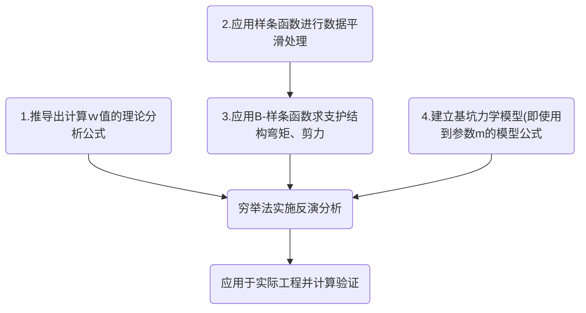

# 文献选读1 - 基坑土层m值反演分析研究

## 前言

​	本次阅读文献是笔者第一次尝试将文献阅读方法从 以前<u>本地阅读+思维导图</u> 到 <u>Markdown笔记+解构文献</u> 的转变，本次阅读的文献是：[基坑土层m值反演分析研究 - 胡睿](https://kns.cnki.net/kcms2/article/abstract?v=9CXCstbk-tt-_FO9teqNf856s6iRcafs1_ub9TH8RP7e6LuOJ0wUXOOZ7spaK-pvEA5Q25jo6dQ36KpjwX7uhQvls06lP28LedjI8xfFVIdvnYwZPKArDTbiMQFNmHGuDVvMkiqg4xNb5-Imp7JJsA==&uniplatform=NZKPT&language=CHS) [[国内访问](https://kns.cnki.net/kcms2/article/abstract?v=9CXCstbk-tt-_FO9teqNf856s6iRcafs1_ub9TH8RP7e6LuOJ0wUXOOZ7spaK-pvEA5Q25jo6dQ36KpjwX7uhQvls06lP28LedjI8xfFVIdvnYwZPKArDTbiMQFNmHGuDVvMkiqg4xNb5-Imp7JJsA==&uniplatform=NZKPT&language=CHS)] [[海外访问](https://scholar.google.com/scholar?hl=zh-CN&as_sdt=0%2C5&q=%E5%9F%BA%E5%9D%91%E5%9C%9F%E5%B1%82m%E5%80%BC%E5%8F%8D%E6%BC%94%E5%88%86%E6%9E%90%E7%A0%94%E7%A9%B6&btnG=)] 硕士论文 昆明理工大学

## 文章背景、概念和方法论路线

### 	（一）背景和概念

​	大量岩土工程涉及到地下岩土体，因岩土体的复杂性采用 <u>正演</u> 的方法常常难以得到准确的分析结果，由于岩土参数的不确定性， 工程人员常需要根据实测数据来 <u>反演</u> 其参数才能做进一步研究。

表1. 术语表 Ⅰ

| 术语           | 释义                                                         |
| -------------- | ------------------------------------------------------------ |
| 正演（正分析） | 已知模型的参数，通过计算得出模型的响应，比如位移、内力等。在岩土工程中，就是已知土体参数，通过力学计算得出基坑支护结构的变形和内力。 |
| 反演（反分析） | 已知模型的响应，反推模型的参数。在岩土工程中，就是利用监测到的支护结构位移等数据，反推土体的力学参数，如弹性模量、黏聚力等。 |

​	
​	目前，期刊论文和学位论文中常出现的基坑支护结构的设计方法主要有以下几种：

​	​	1.了解了m对于水平反力、支护结构/土体位移、弯矩的影响后，回到文章，接下来需要了解对于m的反演方法有哪些，文中提到了一些现有常用的反演分析方法：1. 弹性地基梁法（又称弹性支点法）：这是目前中国普遍采用的方法，也是实际工程中最优先使用的方法。将支护结构（桩等）简化为梁，土体简化为弹性地基，用弹簧模拟，按文克尔假定（梁身任一点的土抗力和该点的位移成正比）进行求解，这也是文中重点分析的方法。
​	​	2. 极限平衡法：假定土体处于极限平衡状态，通过分析土体的极限平衡方程计算支护结构的内力和稳定性。
​	​	3. 有限单元法：将土体、支护结构离散为有限个单元，建立单元的本构关系，考虑土体与支护的相互作用，用数值方法求解位移和内力。目前广泛使用的商业软件如PLAXIS、FLAC、ABAQUS等都可以方便地进行有限元分析。
​	​	4. 槽壁稳定法：通过分析无支撑的槽壁稳定性，确定支护结构的内力和截面。这种方法较为简单，但不能考虑变形的影响。
​	​	5. 经验方法和类比法：根据类似工程的经验确定支护结构的型式和尺寸。这种方法可以用于初步设计，但缺乏理论依据。
​	​	6. 信赖度分析法：基于概率理论，考虑荷载、材料和计算模型等因素的不确定性，进行可靠度分析和设计。
​	​	7. 智能优化设计：利用遗传算法、粒子群算法等智能优化方法，以工程量或造价最小为目标，对支护结构的尺寸、材料等进行优化设计。

​	目前的工程勘察报告中尚不能正确提供各类土层的水平向基床系数，另外，而大量工程实践和计算分析均表明,基坑土层水平反力系数的比例系数ｍ值对支护结构的变形和内力的影响较大， 甚至影响着基坑支护方案的选择。

​	表2. 术语表 Ⅱ

| 术语                   | 符号 | 释义                                                         |
| ---------------------- | ------------- | ------------------------------------------------------------ |
| 水平向基床系数         | kh | 土体提供的水平反力与支护结构水平位移的比值，即 k=p/y，其中p为水平反力，y为位移。它表征了土体的水平变形能力，类似于弹簧刚度。水平基床系数通常随深度增加而增大。(梦回高中胡克定律) |
| 水平反力系数的比例系数 | m             | 水平基床系数随深度增加的梯度。在m法中，假定水平基床系数kh与深度z呈线性关系，即kh = m × z。m值反映了土体水平刚度随深度变化的快慢。m值越大，表明土体水平刚度随深度增加越快。 |

​	这两个系数都反映了土体对支护结构的水平支撑作用，是评价土体变形特性的关键参数。其中，m值作为设计参数被直接用于弹性地基梁法的计算中。但由于缺乏室内或原位测试手段，工程勘察报告中往往难以直接给出这两个系数。因此，基坑支护设计中的m值常需要设计人员根据经验选取或通过反分析的方法确定

​	通过一个简单的计算例子来说明m值对支护结构变形和内力的影响

​	假设有一个简支梁式的支护结构,长度为L,均匀分布荷载为q。梁的弯曲刚度为EI，水平地基基床系数为kh=mz。根据弹性地基梁理论,梁的微分方程为：
$$
EI\frac{d^4y}{dz^4}+mz y=q
$$
​	其中y为梁的水平位移。

​	我们分别取m=0，m=1000，m=5000，代表土体刚度由小到大的三种情况，其他参数取值如下：
$$
L=10\mathrm{m}, q=100\mathrm{kN}/\mathrm{m}, EI=1\times10^6 \mathrm{kN}\cdot \mathrm{m}^2
$$

​	用差分法数值求解上述微分方程，可以得到梁沿深度方向的位移和弯矩分布，结果如下表：

​	表3. 例子的差分法数值求解结果

| 深度 z (m) | 位移 y (mm) |        |        | 弯矩 M (KN · m) |        |
| ---------- | ----------- | ------ | ------ | --------------- | ------ |
|            | m=0         | m=1000 | m=5000 | m=0             | m=1000 |
| 0          | 51.7        | 28.4   | 13.1   | 0               | 0      |
| 2.5        | 48.9        | 18.6   | 5.1    | 122             | 58.6   |
| 5          | 43.4        | 9.6    | 1.6    | 217             | 78.5   |
| 7.5        | 35.3        | 3.4    | 0.3    | 265             | 63.4   |
| 10         | 25          | 0.3    | 0      | 250             | 25     |

从结果可以看出: 
m值越大，支护结构的位移越小。当m=0时，即无土体支撑，最大位移达到51.7 mm；当m=5000时,最大位移降至13.1 mm，减小了75%。
m值越大，支护结构的弯矩也越小。m=0时，最大弯矩为 265 kN·m；m=5000时,最大弯矩降至25 kN·m，减小了91%。 
随着m值增大，弯矩分布逐渐由梯形分布变为三角形分布，弯矩最大点位置也在向上移动，表明被动土压力的分布形状和大小受m值影响很大。

图1. 例子的弯矩随参数m变化图

​	了解了m对于水平反力、支护结构/土体位移、弯矩的影响后，回到文章，接下来需要了解对于m的反演方法有哪些，文中提到了一些现有常用的反演分析方法：

​	1.直接法或直接逼近法：将参数反演问题视为目标函数的寻优问题，通过迭代最小化误差函数，直接修正待反演参数的估计值，如单变量法、模式搜索法、Powell法和单纯形法等。
​	2. 梯度法：如最速下降法、共轭梯度法和牛顿法等,通过目标函数的梯度信息加快优化进度，但需要进行求导运算。
​	3. 人工智能算法：如神经网络法、群智能算法、退火算法、进化策略和遗传算法等，利用随机搜索和启发式规则寻找全局最优解，适合处理复杂的非线性多参数问题。但并没有考虑到土体的物理本构关系， 直接对土体力学参数和位移之间的非线性关系进行描述， 缺乏了对现象的物理解释。

​	（扩展）除了文中提到的方法外,其他常用的反演分析方法还有:

​	4. 贝叶斯方法：基于贝叶斯统计理论,将待反演参数视为随机变量,通过贝叶斯公式更新参数的后验概率分布,可以定量描述反演结果的不确定性。常见的算法有马尔可夫链蒙特卡洛法(MCMC)、卡尔曼滤波法等。
​	5. 蒙特卡洛法：通过随机抽样产生大量可能的参数组合,用正演模型计算对应的响应,根据响应与实测数据的吻合程度筛选最优参数。该方法原理简单,但计算量大。
​	6. 响应面法：通过正交试验设计选取有限个参数组合,用正演模型计算对应的响应,然后用多项式函数拟合参数与响应的关系(即响应面),再用优化算法搜索响应面得到最优参数。该方法可以减少正演计算次数。
​	7. 集合卡尔曼滤波(EnKF)：将卡尔曼滤波与蒙特卡洛法相结合,用一组随机样本(集合)表示状态变量和参数的概率分布,通过集合样本的均值和方差估计状态和参数的最优值及其不确定性。
​	8. 混合算法：将不同的反演算法组合起来,发挥各自的优势。如遗传算法与神经网络的结合,粒子群算法与模拟退火的结合等。

​	我们阅读的这篇文献中作者使用的主要是基于穷举搜索法的反演分析方法，在下面的方法论部分会讲到。

### 	（二）方法论/技术路线

​	文章提出了一种 基于<u>样条函数</u>、<u>平面杆系结构的弹性支点法</u>和<u>穷举搜索法</u>相结合的 反演分析算法（听起来很唬人，我们来拆解分析就简单了，读文献就是要解构文献和方法）。

​	表4. 术语表 Ⅲ

| 术语                     | 释义                                                         |
| ------------------------ | ------------------------------------------------------------ |
| 样条函数                 | 样条函数是一种分段多项式函数,在数值分析中常用于函数逼近和数据拟合。它的特点是函数在各分段内由低阶多项式构成，在分段点处满足一定的连续性条件,因此具有良好的光滑性和逼近性能。 |
| 平面杆系结构的弹性支点法 | 弹性支点法是一种常用的支护结构计算方法,也称为弹性地基梁法。它的基本思想是将支护结构简化为平面杆系模型，将土体简化为一系列独立的弹性支点(弹簧)，然后利用结构力学的方法求解支护结构的变形和内力。 |
| 穷举搜索法               | 穷举搜索法是一种最简单、最直接的参数反演方法，也称为网格搜索法或枚举法。它的基本思路是:在待反演参数的可能取值范围内，通过穷举所有可能的参数组合，利用正演模型计算每一组参数对应的模型响应，然后根据某一准则(如最小二乘误差)评价各参数组合的拟合优度，从而确定最优参数。 |

​	我们分别来讨论这三种概念是如何在这篇文章中应用的：

​	1.样条曲线（实际就是数据平滑处理）：作者使用了三次样条函数对实测的支护结构位移数据进行平滑处理。这一步骤的目的是减少测量误差的影响,为后续的反演分析提供更可靠的数据基础。通过样条函数拟合,可以得到位移变化的连续曲线,并方便地进行数值求导,计算支护结构的转角和内力。
​	2.平面杆系结构的弹性支点法（反演推参数m，总得有个正向的计算模型公式吧，这里就是选个模型来套）：在本文中,作者采用了平面杆系结构的弹性支点法建立支护结构的正演力学模型。具体做法是:将支护桩分为若干梁单元,桩底以上的土体视为弹性支点,桩底以下的土体视为弹性地基梁,同时考虑水平荷载和支撑反力的作用。通过建立平衡方程和变形协调方程,并利用有限元法或矩阵位移法等数值方法求解,可以得到支护结构在给定参数条件下的变形和内力分布。
​	3.穷举搜索（这一步才是正经反演的步骤，简单版的蒙特卡洛方法）：在本文中,作者将m值计算公式中的Δ1和Δ2作为待反演参数,通过穷举搜索的方式,在一定范围内生成大量可能的参数组合。对于每一组参数组合,利用弹性支点法计算支护结构的变形和内力,并与实测数据进行对比,根据误差大小筛选出最优参数组合,进而反演出土层的等效m值。

​	最后，简单的组合起来：样条函数用于数据预处理，弹性支点法用于正演计算，穷举搜索法用于参数优选。

图2. 文章中的技术路线图

​	个人看来，文章中的反演分析算法虽然有一定的理论基础和实际效果，但仍有一些局限性，如计算量大、收敛性难以保证等。关于这篇文章的创新性和实用性，可根据本人博客中之前的文章 “[学术期刊论文寻找创新点的方法和技巧](学术期刊论文寻找创新点的方法和技巧)” 来判断。

## 文章的详细反演及计算过程

​	我们按照如下步骤进行复现推导：

### 	（一）推导出计算ｗ值的理论分析公式

​	1.假设支护结构底端嵌入坑底土体足够深，基坑处于弹性抗力状态时近似地认为支护结构底端的位移量为零。当基坑处于被动极限状态时支护结构底端产生微小位移量。
​	2.假设嵌固段内土体为同一层土，基坑开挖面附近支护结构的水平位移量为s0。
​	3.基于弹性半空间应力状态理论，在嵌固段被动区内取一微单元进行应力分析，并结合线弹性本构方程推导出土体反力公式: 
$$
σ_x = γzk_0 + Es/(1-μ^2) * εx
$$
​	其中σx为被动区土体水平方向应力，γ为土体重度,k0为静止土压力系数，Es为被动区土体弹性模量，μ为泊松比，εx为被动区土体水平向应变。

​	4.考虑到实际工程中土体弹性模量、泊松比等难以准确确定，提出假设基坑被动区土层处于弹性抗力状态时，水平反力系数可表示为: 
$$
ks = mz+k_0 = mz + 2ctan(45°+φ/2) *Δ_1 /s0
$$
​	其中m为土层水平反力系数的比例系数，Δ1为强度折减系数，c为土体黏聚力，φ为内摩擦角。

​	5. 进一步考虑基坑开挖卸载效应，引入基坑开挖深度h，假设开挖底部达到被动极限状态时位移：
$$
sp(z=D)=Δ_2*h
$$
​	Δ2为小于1的经验系数，最终得到m值计算公式：
$$
m=γ[tan^2(45°+φ/2)-k_0]*Δ_1/(Δ_2*h)
$$

​	该公式综合考虑了土体重度、内摩擦角、侧压力系数和基坑开挖深度等因素对m值的影响，系数Δ1和Δ2被视为待反演参数。其中：

​	Δ1的引出：是考虑基坑开挖时的上部土体卸载作用导致开挖面附近的土体己处于超固结状态，故基坑开挖面处的初始土反力系数A0≠0：
$$
A_0=2ctan(45°+φ/2)Δ_1/S_0
$$

​	Δ2的引出：是考虑基坑土层ｍ值在基坑开挖过程中并非是固定的， 而是随着基坑开挖深度的增加逐渐减小的，文章的作者在这里简单的考虑m伴随开挖深度h线性变化：
$$
δ_p(z=D)=Δ_2h
$$

### 	（二、三）样条函数进行数据平滑处理和插值计算

#### 引出样条函数

​	对于给定的数据， 当拟合函数类型未知时， 若直接采用分段多项式拟合， 则在连接点处的光滑性并不佳， 因此引入样条函数。以下是文中如何将样条函数应用于监测数据平滑的过程：

图3. 应用样条函数的数据平滑流程图

​	1.首先,文中定义了给定数据点 (xi, yi), i=1,2,...,N 和 权重p，寻找函数σ(x)使得泛函J[σ]取极小值的问题：
$$
J[f] = I_q[f] + pE_p[f] = p·∫[f^q(x)]^2 dx + ∑(f(x_i) - y_i)^2
$$
​	然后引入标准差σ.

​	2.通过递推公式计算样条函数基底，计算B样条函数在各数据点处的值，构造矩阵B。
$$
b_{ij} = B_j(x_i)~~~~, ~~~i,j=1,2,...N
$$
​	B样条函数 Bj(x) 是一组基函数,具有良好的数学性质如局部支撑性、正性等。通过递推公式可以快速计算 Bj(x) 在任意点 x 处的值。将 Bj(xi) 的值按照 i,j 的顺序排列形成矩阵 B，用于后续计算。

​	3.计算系数 eij ，形成矩阵E。eij  实际上是 B 样条函数 q 阶导数在节点 xi 处的值乘以一个系数，反映了拟合函数在该点的光滑性。将 eij 按照 i,j 的顺序排列形成矩阵 E 。

​	4.构造矩阵：
$$
A = B + p^(-1)*E。
$$
​	将B样条函数值和导数值组合形成矩阵A，同时引入权因子p调节光滑性和逼近性。矩阵B反映了拟合函数对数据点的逼近程度，矩阵E反映了拟合函数的光滑程度。通过p来调节两者的相对重要性，p越大，拟合函数越光滑，p越小，拟合函数越逼近数据点。

​	5.求解方程组 Ac = y ，得到系数 cj 。方程组Ac=y实际上是一个简单的最小二乘问题，通过求解该方程组，可以得到一组系数 cj ，使得拟合函数σ(x)在数据点处的值与实际值 yi 尽可能接近，同时满足一定的光滑性要求。

​	6.判断 (yi-σ(xi))2 之和是否小于 Nσ2 ，若满足则进入下一步，否则用公式 (3.30) 迭代计算新的权因子 p，返回第4步。这一步是根据拟合误差决定是否需要调整权因子p的值。将拟合函数σ(x)在各数据点处的值与实际值 yi 的差异平方和与 Nσ2 进行比较， Nσ2 反映了数据误差的大小。如果差异平方和小于Nσ2，说明拟合函数对数据点的逼近程度已经满足要求，可以输出结果;否则需要调整p的值，使拟合函数更光滑或更逼近数据点，直到满足条件为止。

​	7.得到光滑样条函数：
$$
 σ(x) = ∑c_j*B_j(x)。
$$
​	前面计算得到的系数 cj 代入B样条函数的线性组合,就得到了最终的光滑样条函数σ(x)。σ(x)在数据点处逼近实际值yi,在其他位置根据B样条函数的性质进行了光滑插值。

​	总的来说,该方法通过B样条函数的性质构造了一个光滑性和逼近性可调的拟合函数,通过最小二乘法求解系数,并通过权因子的迭代优化来寻找最优的平滑结果。

### 	（四）建立基坑力学模型

​	文章中的力学模型主要根据《建筑基坑支护技术规程》（JGJ120 -2012） 进行推演，这里不做赘述。

### 	（五）蒙特卡洛方法结合穷举法反演

​	由于文章中只介绍了概念和方法（实际工程数据验证中也并没有给出matlab程序），所以这里引出外链了解[蒙特卡洛方法](https://baike.baidu.com/item/%E8%92%99%E7%89%B9%E5%8D%A1%E7%BD%97%E6%B3%95/1225057?fr=ge_ala)。

​	文章中理论部分最后给出了一个流程图：

图4. 应用样条函数的数据平滑流程图

​	最后两部分理论部分比较简单，实验验证部分在文章中也一笔带过，这里不做过多赘述。

## <u>References</u>

1.  胡睿. (2017). *基坑土层 m 值反演分析研究* (Master's thesis, 昆明理工大学).